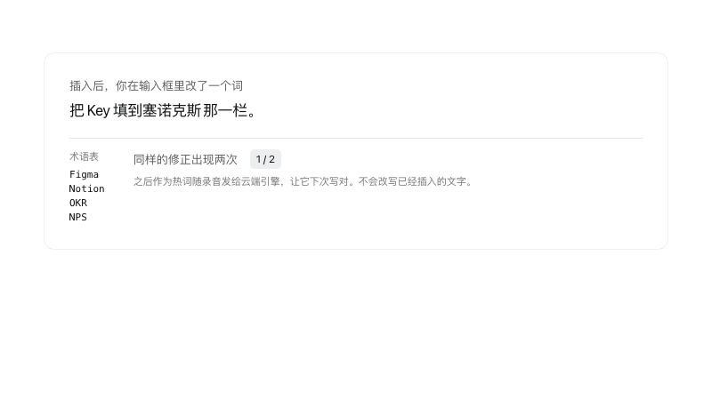

# Totype

[简体中文](README.md) · English

**Totype is a voice input method for macOS. It connects to the best speech recognition models: tap Right Option, speak, and the text lands in whatever field you are typing in. How much your words get changed is up to you.**


[Build from source](#quick-start) · [Prebuilt dmg: coming soon](https://github.com/Towow-ai/totype/releases) · [Manual](docs/manual/en/00-overview.md)

<p align="center"></p>

Totype lives in the menu bar. Put the cursor in any app, tap Right Option to start recording, tap again, and the recognized text is inserted at the cursor. It handles Chinese, English and the two mixed in one sentence. For the cloud engine you can use the real-time models from Soniox or Alibaba Cloud Bailian; to stay offline, use the local SenseVoice engine.

## Features

- **Types into any app.** Right Option to start, again to stop and insert, Esc to cancel. A small overlay at the bottom of the screen shows the state. In a terminal it types the text and never presses Return.
- **Top recognition models.** Connect Soniox (`stt-rt-v5`) or Alibaba Cloud Bailian's Qwen real-time recognition (`qwen-audio-3.0-asr-flash-streaming`) for real-time recognition: the text is ready almost as soon as you stop. Accuracy on mixed Chinese and English was our first criterion when choosing them, and cloud engines cope with embedded English terms better than the local one does.
- **You decide how much changes.** By default the text is inserted as the engine heard it: no LLM rewriting, and repetitions, filler words and self-corrections stay. If you want it tidier, you set the level yourself: the transcription prompt (sent with the recording to a cloud engine; write down your punctuation and filler-word preferences, which the engine treats as a hint, not a command), the glossary and speaker background (help the engine spell your names and terms), mishearing aliases, dropping the final period in chat apps, a trailing space after English, and learning from your manual edits. One utterance is inserted at most once.
- **Free local engine, optional cloud engines.** A bundled SenseVoice model runs offline with no account. For real-time recognition, add your own Soniox or Alibaba Cloud Bailian key and pay the provider by usage.
- **Hot standby and fallback.** With two cloud keys, one engine is primary and the other listens in the background; if the primary errors out or is slow, its result is used. If the cloud fails altogether, the saved audio is transcribed locally. The overlay says which engine produced the text, and Totype never silently switches to macOS dictation.
- **A failed recognition does not lose the recording.** Audio is written to disk before recognition starts. If recognition fails, you cancel, or you switch apps, the recording stays in history and can be transcribed again.
- **Personal dictionary.** Glossary, speaker background, a starter word pack, and mishearing aliases: register a word an engine keeps getting wrong, and it is corrected only when a second engine heard exactly the right spelling at that spot. Export and import the whole profile as JSON, without keys, history or recordings.
- **History.** Search past entries, replay the original audio, and re-transcribe with another engine; the result is saved as a new version.
- **Undo.** After a cancel you have five seconds to undo and resume transcription.

Requires an Apple silicon Mac on macOS 15 or later. The interface is currently in Simplified Chinese only.

## See it work

### Switch engines, bring your own key

<p align="center"></p>

Pick the local engine, Alibaba Cloud Bailian or Soniox as the primary model; cloud engines use your own API key. With both clouds configured, each is the other's hot standby: if the primary errors out or is too slow, the other one's result is used, and if both fail, the saved recording is transcribed locally. The overlay tells you which engine finished the job.

### Mishearing correction

<p align="center"></p>

On the Profile page, register a word's correct spelling and the ways it gets misheard. It is replaced only when the other engine heard exactly the correct spelling at the same spot, so what you actually said is never overwritten.

### Learns from your edits

<p align="center"></p>

If you fix a word by hand after it is inserted and the same fix happens twice, the word joins your personal lexicon and is sent to the cloud engines as a hotword from then on. It only helps future recognition; text already inserted is never rewritten. You can turn it off in Settings.

### You set how tidy it gets

<p align="center"></p>

By default you get every word, including repetitions, fillers and self-corrections, with no LLM rewriting. For tidier text, write your wishes in the transcription prompt (for example, "add punctuation, drop the ums"); it goes to the cloud engine as a hint. Combine it with the glossary, speaker background, and the "remove the final period in chat apps" and "add a space after English" switches.

## Quick start

### 1. Install

A prebuilt dmg is coming to [GitHub Releases](https://github.com/Towow-ai/totype/releases); until then, build from source. You need the macOS 15.4 SDK or later through the Command Line Tools (`xcode-select --install`). Full Xcode is not required.

```bash
git clone https://github.com/Towow-ai/totype.git
cd totype
scripts/install.sh      # builds, installs to /Applications/Totype.app, backs up an existing copy
```

The first build downloads about 246 MB of model files and verifies their checksums. Run `scripts/install_local_signing_identity.sh` once to create a stable local signing identity so permissions survive rebuilds. `scripts/build.sh` builds without installing; `config/local.env.example` lists the settings. See [Install](docs/manual/en/01-install.md).

### 2. Grant three permissions

In System Settings → Privacy & Security:

- **Microphone**: to record.
- **Accessibility**: to insert text into other apps.
- **Input Monitoring**: to listen for Right Option and Esc. Quit and reopen the app after granting it.

The app is not notarized, so an update can invalidate the grants. If that happens, delete the old Totype entries from the three lists and add it again. See [First run](docs/manual/en/02-first-run.md).

### 3. Say your first sentence

Click into any text field, tap Right Option, speak, and tap again. The overlay shows "已插入 N 字" (inserted N characters) and the text is at your cursor. The local engine is the default, so no account is needed.

## Choosing an engine

| | Local (SenseVoice) | Soniox | Alibaba Cloud Bailian |
|---|---|---|---|
| Model | SenseVoiceSmall | `stt-rt-v5` | `qwen-audio-3.0-asr-flash-streaming` |
| Network | Not needed | Required | Required |
| API key | None | Your own | Your own |
| Real-time recognition | No; the result appears after you stop | Yes; live text shows in the menu panel | Yes; live text shows in the menu panel |
| Personal dictionary | Not used | Glossary, speaker background, prompt | Hot words, prompt |
| Cost | Free | Pay Soniox by usage | Pay Alibaba Cloud by usage |
| Good for | Offline use, privacy, trying it out | Speed and accuracy, plus glossary and speaker background | Speed and accuracy if you already have an Alibaba Cloud account |

With both cloud keys saved, the two engines back each other up, and alias correction becomes available. Prices and free quotas change; check each provider's price page and set a spending cap before you start. See [Engines and API keys](docs/manual/en/04-engines-and-keys.md).

## Privacy

With the local engine nothing leaves your Mac. With a cloud engine, your audio, glossary and transcription prompt go to the provider you chose, and to both providers if you save two keys. Totype has no server of its own. API keys are stored in a local JSON file (folder mode 0700, file mode 0600), not in the Keychain. See [Data and privacy](docs/manual/en/07-data-and-privacy.md).

## FAQ

**Does it need the internet?** No. The default local engine is fully offline; the model is downloaded once during the first build. Only the cloud engines use the network.

**Does it rewrite what I say?** Not by default: the text is inserted as the engine recognized it, and no language model touches it. How much to change is your decision; the transcription prompt, glossary, aliases and insertion preferences are described in [Personalization](docs/manual/en/05-personalization.md) and [How much to change](docs/manual/en/06-literal-rules.md).

**Is it free?** The app and the local engine are free. Cloud engines are billed by their providers according to your usage; Totype does not handle or charge for that.

**macOS says it cannot verify the developer.** The app is not notarized. Double-click it once, then open System Settings → Privacy & Security and click Open Anyway, or run `xattr -dr com.apple.quarantine /Applications/Totype.app`.

**Right Option does nothing.** Check that Input Monitoring is granted and that you restarted the app afterwards. The hotkey pauses in password fields and whenever another app holds macOS Secure Input. See [Troubleshooting](docs/manual/en/08-troubleshooting.md).

**Does it run on Intel Macs or Windows?** Not at the moment. It needs Apple silicon and macOS 15 or later.

The full list of known limits is in [Glossary and limits](docs/manual/en/10-glossary-and-limits.md).

## Documentation

[Manual](docs/manual/en/00-overview.md): install, first run, daily use, engines and keys, personalization, insertion rules, data and privacy, troubleshooting, build and contribute.

## Contributing

Build, test, configuration and repository layout are in [Build and contribute](docs/manual/en/09-build-and-contribute.md). Bug reports and ideas are welcome as issues.

## License and third-party notices

Totype is released under the [Apache License 2.0](LICENSE); see also [NOTICE](NOTICE).

The local engine uses **SenseVoiceSmall** by FunASR / FunAudioLLM (Alibaba Group), run through `llama-funasr-sensevoice` (MIT) and ggml / llama.cpp (MIT), with the FSMN-VAD model (Apache-2.0). The SenseVoiceSmall weights are covered by the FunASR Model Open Source License v1.1, which requires attribution to the source and author and keeping the model name; the model name and file name are kept unchanged. Read the license before using the weights, in particular its terms on use, and if you plan commercial use, note that the upstream project's answer on commercial use is still marked as not final. Full texts and versions are in [THIRD_PARTY_NOTICES.md](THIRD_PARTY_NOTICES.md). The repository does not contain the model weights; the build and the lite app download them from their original sources.
