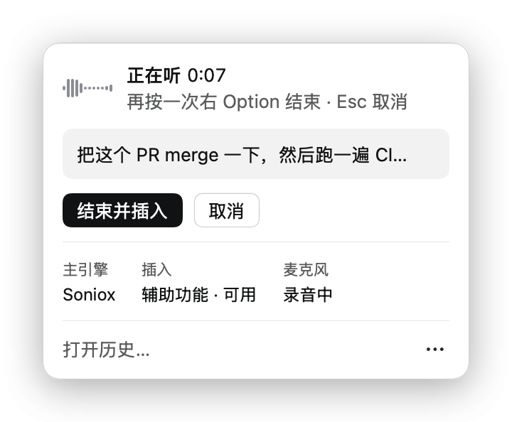

# 00 Overview

[简体中文](../zh-CN/00-overview.md)

Totype is a voice input method for the macOS menu bar. It connects to top-tier recognition models: Soniox and Alibaba Cloud Bailian for real-time recognition, or the local SenseVoice engine fully offline. Tap Right Option to start talking, tap it again, and the text lands in the field you are typing in. By default the text is exactly what the engine heard, with no LLM polishing; how much it gets tidied is up to you. It needs a Mac with Apple silicon and macOS 15 or later.

## Contents

| Chapter | Covers |
|---|---|
| [01 Install](01-install.md) | Download, build from source, update, uninstall |
| [02 First run and permissions](02-first-run.md) | Microphone, Accessibility, Input Monitoring |
| [03 Daily use](03-daily-use.md) | Start, stop, cancel, the overlay, history |
| [04 Engines and API keys](04-engines-and-keys.md) | Local model, Soniox, Alibaba Cloud Bailian, costs |
| [05 Personalization](05-personalization.md) | Glossary, aliases, speaker background, prompt, export/import |
| [06 How much to change](06-literal-rules.md) | Verbatim by default, and the settings that change how much is edited |
| [07 Data and privacy](07-data-and-privacy.md) | Where data lives, what goes to the cloud, how to wipe it |
| [08 Troubleshooting](08-troubleshooting.md) | Hotkey, permissions, insertion, cloud errors |
| [09 Build and contribute](09-build-and-contribute.md) | Building, tests, configuration, repository layout |
| [10 Glossary and limits](10-glossary-and-limits.md) | Terms and known limitations |

## What it does

Totype turns speech into text at your cursor, and you decide how much it changes along the way. The defaults are strict, and a few promises hold at every setting:

- No language model rewrites your text. By default repetitions, filler words, self-corrections and mixed Chinese/English come through as recognized. The settings that make the result tidier (transcription prompt, glossary, aliases, insertion preferences) are covered in [05 Personalization](05-personalization.md) and [06 How much to change](06-literal-rules.md).
- One utterance is inserted at most once. Even when something is uncertain during insertion, the same text is never inserted twice.
- Audio is written to disk first. The recording is saved before recognition finishes, so a failed or cancelled attempt can be transcribed again from history.
- The only change to the text is restoring a known mishearing you registered. When two cloud engines disagree at the same spot and the second engine heard exactly the spelling you registered, that spelling replaces the first engine's version. See [05 Personalization](05-personalization.md).

It never quietly switches to macOS system dictation. When the engine you chose cannot be used, the interface says why and which engine produced the result.

## Who it is for

People who dictate in Chinese with English terms mixed in and want to control how much of their wording is changed: writing documents and prompts, or entering long sentences in chat apps and terminals. Totype has no summarizing, translation or LLM polishing mode.

## Requirements

- A Mac with Apple silicon (M1 or later), macOS 15 or later.
- About 250 MB of disk space for the local model. The local engine needs no account and no network.
- Cloud engines need your own Soniox or Alibaba Cloud Bailian API key, and you pay the provider by usage.

## Interface language

The app interface is currently Simplified Chinese only. This manual quotes interface text in Chinese, followed by an English gloss in parentheses, for example `设置` (Settings).

## Terms used in this manual

The "menu panel" is the small panel that opens from the menu bar icon. The "overlay" is the capsule at the bottom of the screen that shows status. The "history window" opens from `打开历史…` (Open history…) in the menu panel; it has the history list on the left and details on the right, and also holds the `设置` (Settings) and `个人资料` (Profile) pages.

