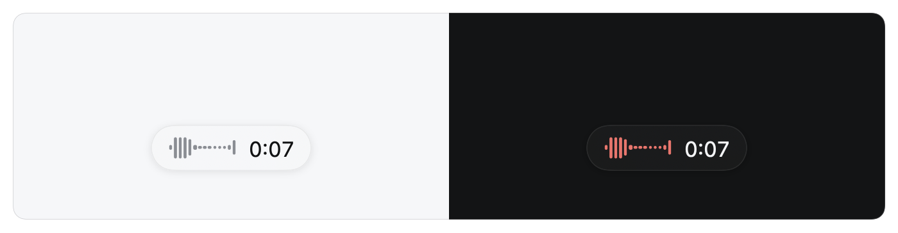
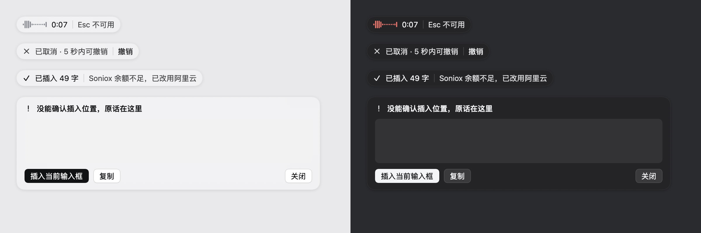
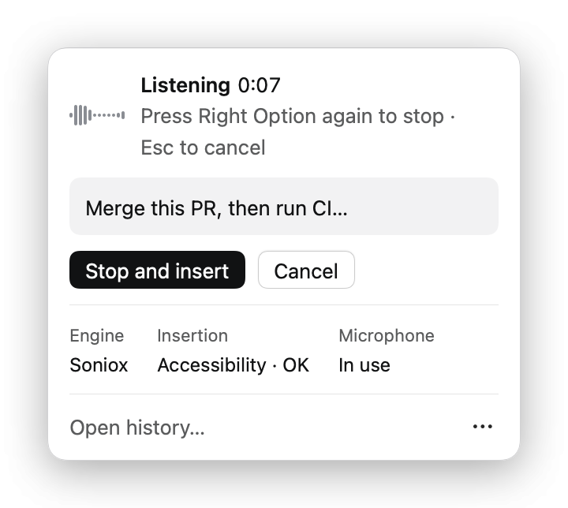
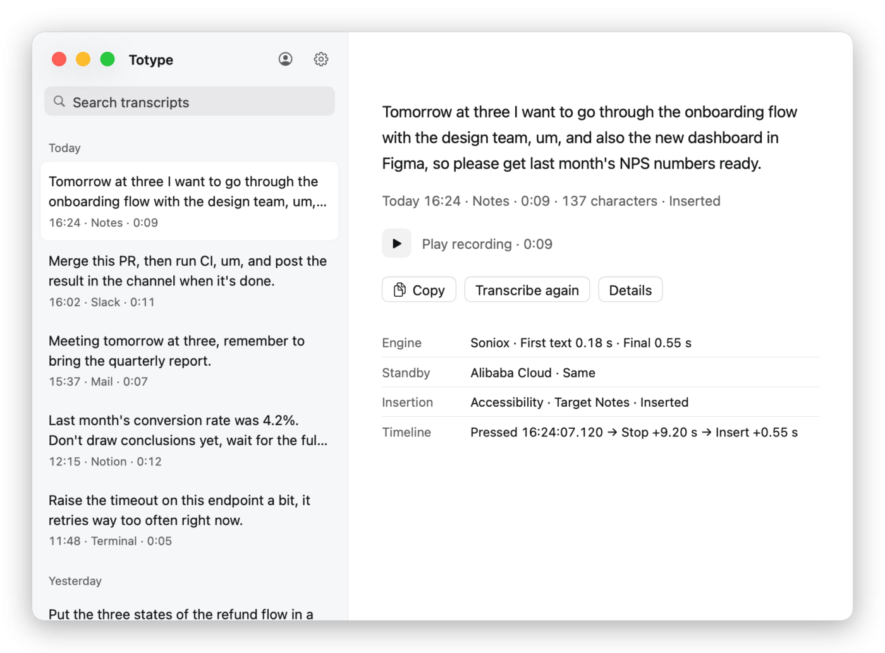

# 03 Daily use

[简体中文](../zh-CN/03-daily-use.md)

Tap Right Option to start recording, tap it again to stop and insert, press Esc to cancel. An overlay at the bottom of the screen shows the state. Text goes only into the app that had focus when you started, and in a terminal it types the text without pressing Return.

## The basic flow

1. Put the cursor where the text should go.
2. Tap **Right Option**. The overlay appears with a waveform and a timer: `正在听` (Listening).
3. Speak.
4. Tap Right Option again. The overlay switches to `识别中` (Recognizing), then inserts the text and shows `已插入 N 字` (Inserted N characters). If another engine produced this result, the overlay says so after that, for example `Soniox 余额不足，已改用阿里云` (Soniox balance too low, switched to Alibaba Cloud).

You can also skip the hotkey: the buttons `开始录音` (Start recording) and `结束并插入` (End and insert) in the menu panel do the same thing.

A single recording lasts at most 10 minutes by default (up to 30 minutes) and is finalized automatically at that point. The limit can be changed under `高级与诊断` (Advanced and diagnostics) in `设置` (Settings).

## Cancel and undo

Press **Esc** while recording, or click `取消` (Cancel) in the menu panel, and the recording is discarded without inserting anything. The overlay shows `已取消 · N 秒内可撤销` (Cancelled · undo within N seconds). Within 5 seconds, click `撤销` (Undo), or `撤销取消` (Undo cancel) in the menu panel, to resume and transcribe; pressing right Option during the countdown starts a new recording instead. The audio of a cancelled recording stays in history, so you can transcribe it later.

Esc relies on the Input Monitoring permission. When it is missing, the overlay and the menu panel say `Esc 不可用` (Esc unavailable).

## Overlay states

| Overlay text | Meaning |
|---|---|
| `正在听` with waveform and timer | Recording. The red color appears only on the waveform while recording |
| `识别中` | Recording stopped; transcribing and inserting |
| `已插入 N 字` | The text was sent to the field, sometimes followed by a note such as which engine was used |
| `已取消 · N 秒内可撤销` | Cancelled; you can undo during the countdown |
| An error message with "!" | Nothing was inserted; the message gives the reason, and the recording is in history |
| Preview card | The insertion target could not be confirmed. The text is shown in the card with `插入当前输入框` (Insert into current field), `复制` (Copy) and `关闭` (Close) |

Screenshot: 

## The preview card

In these cases Totype does not force the text in. It shows a preview card and lets you decide:

- You switched to another app before stopping (`你已切换到其他应用，未自动输入；可点“复制”` — you switched apps, nothing was typed, click Copy).
- Keyboard typing was detected after you stopped, so the text was not inserted automatically, to avoid interrupting what you were typing.
- The state of the target app could not be confirmed.

In the card, `插入当前输入框` puts the text into whatever field has focus now, `复制` puts it on the clipboard, and `关闭` discards the card. Automatic insertion never touches the clipboard; it changes only when you click `复制`.

## When recording will not start

- **A Chinese input method is composing.** If candidate text from Pinyin or another input method has not been committed, you see `检测到尚未上屏的中文输入法组合文本；先上屏或取消拼音，再按一下右 Option` (uncommitted input method text detected; commit it or cancel Pinyin, then tap Right Option again).
- **A secure input field.** Voice input pauses in password fields. When another app holds macOS Secure Input, the hotkey may not receive events; the message is `系统 Secure Input 正在占用键盘事件；先退出密码框或关闭占用它的应用` (Secure Input is holding keyboard events; leave the password field or close the app that holds it).
- **The chosen engine is not configured.** For example, with Soniox selected and no key saved: `已选择 Soniox，但未配置 API Key；不会切换到系统听写` (Soniox selected but no API key; will not fall back to system dictation).

## The menu panel

Click the menu bar icon. The panel shows the current state with a one-line hint, the start or end button, and three facts: `主引擎` (Primary engine; `未配置` after the name means that engine is not usable yet), `插入` (Insertion; whether Accessibility works), and `麦克风` (Microphone; either recording, or `按需释放` meaning released on demand: the microphone is fully released when you are not recording, so features like Continuity are not blocked). `打开历史…` at the bottom opens the history window. The `⋯` menu holds `检查辅助功能`, `检查输入监控`, `打开数据目录` (Open data folder) and the quit item.

Click Settings… in the menu panel or press ⌘, in Totype to open settings; the Settings window opens on the settings page the first time. Click Profile… to open your profile, or use the person and gear icons at the top of the window to switch between the two pages.

## The history window

The left side lists the 20 most recent entries grouped by day, with `搜索原话` (Search your words) on top. A single click copies the entry's full text and shows its details on the right: the text, time, target app, duration, character count and outcome (inserted, preview only, cancelled, failed and so on).

The detail page offers:

- **Play recording.** Plays the saved original audio.
- **Copy.** Copies the full text.
- **Re-transcribe** (`重新转写`). Runs the saved audio through an engine again. Under `详情` (Details) you can choose `自动` (Automatic), `Soniox`, `阿里云` (Alibaba Cloud) or `本地` (Local). The result is added as a new version; it is never inserted automatically and never overwrites the original text.
- **Details.** Expands the versions, the primary engine's first-frame and final latency, whether the hot standby agreed, the insertion method and the timeline.

An entry that has audio but no text shows `已保留音频，尚无文字` (Audio kept, no text yet); `重新转写` can fill it in. Click the app name at the top left to return to the recording state, the person icon to open `个人资料` (Profile), and the gear icon to open `设置`.

## Interface language

The interface is in English or Simplified Chinese. By default it follows your system language order (a Chinese language first in System Settings → General → Language & Region gives Chinese, anything else gives English). To choose one, open Settings (the gear icon) → Language, pick Follow system, 简体中文 or English, then click Restart now. The choice is also saved in an exported profile.
