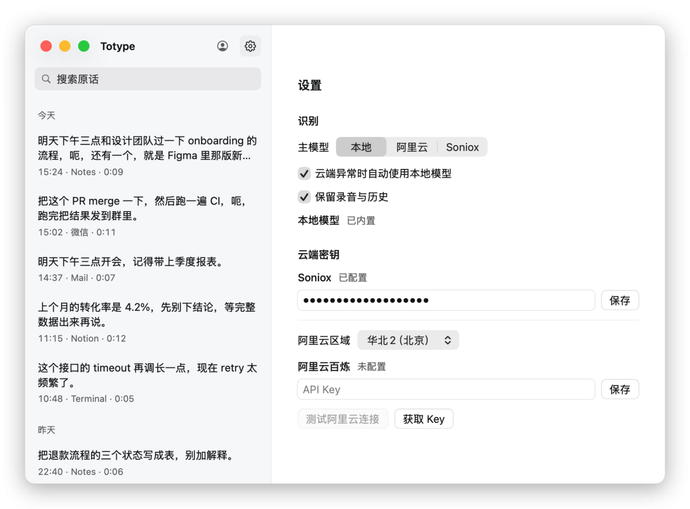

# 04 Engines and API keys

[简体中文](../zh-CN/04-engines-and-keys.md)

Totype has three recognition engines. The local SenseVoice engine runs offline and needs no key. Soniox and Alibaba Cloud Bailian are cloud engines: they need your own API key and bill you by usage. The default primary engine is the local one. Pick a cloud engine if you want real-time recognition, with the text ready almost as soon as you stop.

## The three engines

| Engine | Network | Key | Notes |
|---|---|---|---|
| Local (SenseVoiceSmall q8) | No | No | Returns the result in one piece after you stop; no live captions. Apple silicon only. Does not use your personal lexicon or speaker background |
| Soniox (stt-rt-v5) | Yes | Yes | Real-time; supports glossary, speaker background and prompt |
| Alibaba Cloud Bailian (Qwen real-time speech) | Yes | Yes | Real-time; supports hotwords and prompt; Beijing or Singapore region |

On the `设置` (Settings) page of the history window, the `主模型` (Primary model) selector in the `识别` (Recognition) section switches between `本地`, `阿里云` and `Soniox`.

## Getting and saving a key

In the `云端密钥` (Cloud keys) section of `设置`:

1. **Soniox.** Sign up at the Soniox console (`https://console.soniox.com`), create an API key, paste it into the `API Key` field of the Soniox row and click `保存` (Save). `已配置` (Configured) appears next to the name.
2. **Alibaba Cloud Bailian.** Click `获取 Key` (Get key) to open Alibaba Cloud's instructions and create a key in the Bailian console. First set `阿里云区域` (Alibaba Cloud region) to match the site your key belongs to: `华北2（北京）` (North China 2, Beijing) is the China site, `新加坡` (Singapore) the international site. Paste the key into the Bailian row, save it, then click `测试阿里云连接` (Test Alibaba Cloud connection) to verify.

Leaving the field empty and clicking `保存` deletes the key. [07 Data and privacy](07-data-and-privacy.md) says where keys are stored.

## Costs

Cloud engines bill by usage, and the provider charges you directly; Totype does not handle or charge any money. Prices and free quotas change, so check each provider's pricing page. Set a spending cap or a balance alert in the provider console before you start.

If you keep recordings and history, you can re-transcribe the same audio with a different cloud engine. That also counts as one use of that cloud service.

## Two clouds at once: primary and hot standby

Once both keys are saved, the engine you chose as primary handles the recording while the other cloud runs in the background as a hot standby. Both engines receive your audio. If the primary fails, runs out of balance or finishes too slowly, Totype uses the standby's result and the overlay says which one it used. The standby has a second job: the two results can corroborate each other for mishearing restoration; see [05 Personalization](05-personalization.md).

When a cloud is unusable because of balance or a rejected key, the top of the menu panel shows a message such as `Soniox 余额不足，已改用阿里云`, with two actions: `去充值` (Top up) or `检查 Key` (Check key), and `重试` (Retry). After topping up or fixing the key, click `重试`.

## What happens when a cloud fails

Totype never silently falls back to macOS system dictation. When a cloud fails it goes one of two ways, and both are visible:

- `云端异常时自动使用本地模型` (Use the local model automatically when the cloud fails) is on by default. If the cloud does not return in time, Totype transcribes the saved audio locally and the overlay marks the result `本地` (Local). Turn the switch off if you prefer an error when the cloud fails; the audio stays in history and can be transcribed again later.
- If the local model is not completely installed, this fallback is unavailable.

`保留 Apple 对照` (Keep Apple baseline), under `高级与诊断`, is off by default. When on, the system dictation result is kept in history for comparison only and is never inserted.

## Safety advice

- Set a spending cap on your cloud keys and use them only on your own computer.
- Do not send `personal-secrets.json`, or a backup containing it, to anyone.
- When you stop using a cloud, clear its key and click `保存`.
