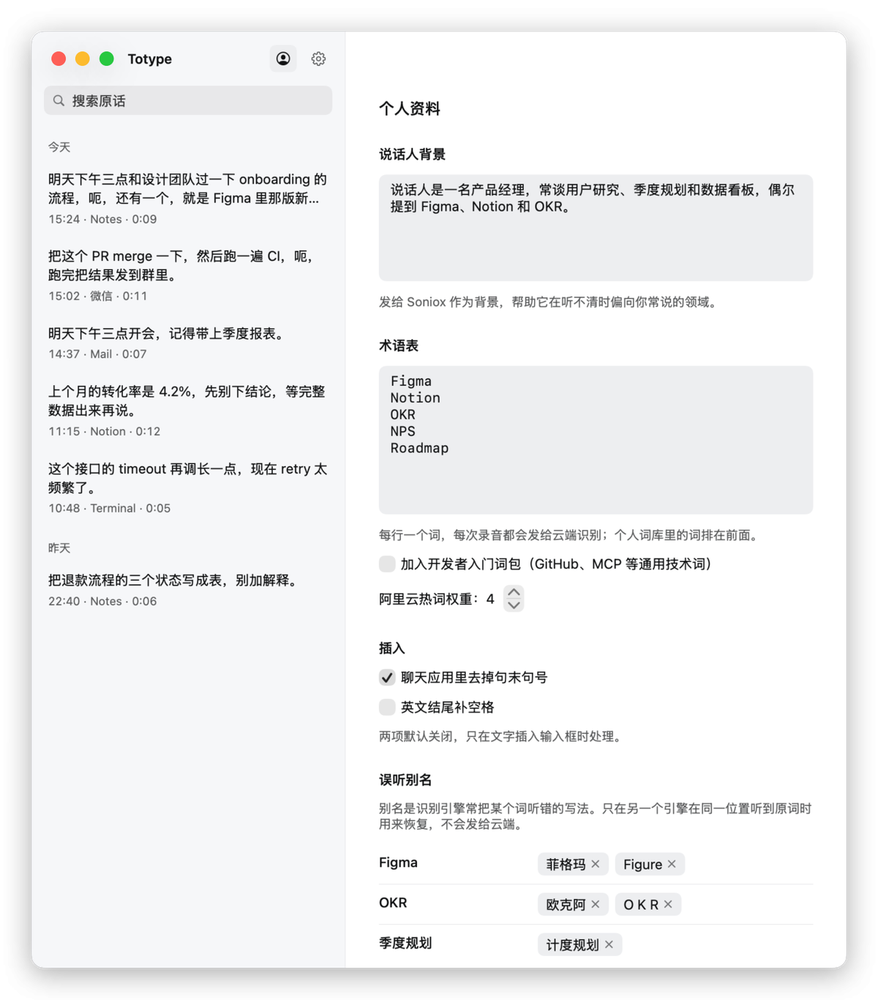

# 05 Personalization

[简体中文](../zh-CN/05-personalization.md)

The `个人资料` (Profile) page nudges recognition toward your vocabulary: describe your field, register terms you use, and set aliases for words that get misheard. These entries mostly change the hints a recognition engine receives; they do not rewrite what you said afterwards. The one direct text change is alias restoration, and it needs a second engine to confirm. The local engine uses nothing from the profile. This page is where you decide how much your words get changed; the insertion preferences that finish the job are in [06 How much to change](06-literal-rules.md).

To open it, click the person icon at the top left of the history window.

## Speaker background

Write a sentence or two about who you are and what you talk about, for example "The speaker is a product manager who often discusses user research, quarterly planning and dashboards." It goes to Soniox as background and helps the engine lean toward your field when the audio is unclear. Write identity, topics and common words only, not instructions. Alibaba Cloud and the local engine do not use this field.

## Glossary

One term per line: product names, people, abbreviations. The glossary is sent to the cloud engines with every recording. Soniox takes it as recognition context and Alibaba Cloud takes it as hotwords. `阿里云热词权重` (Alibaba Cloud hotword weight, 1 to 5, default 4) controls how strongly hotwords influence Alibaba Cloud results. Raise it for words that are often misheard; a very high weight can also make unrelated sounds come out as that word.

`加入开发者入门词包` (Add the developer starter pack) adds a general list of technical words such as GitHub, MCP, Docker and TypeScript. It is off by default. Words in your personal lexicon are sent first.

Automatic learning: `观察插入后的人工修改` (Observe manual edits after insertion), under `高级与诊断` in `设置`, is on by default. When you edit inserted text in the target field and the same correction shows up at least twice, Totype adds the corrected word to your personal lexicon on its own and shows `已自动学习热词` (Hotword learned automatically). From then on it is sent to the cloud engines with your recordings. Turn the switch off if you do not want this; words already learned can be deleted from the lexicon.

## Mishearing aliases and restoration

Some words are always misheard in the same wrong way, for example "Sonnet" heard as "Sonet". In the `误听别名` (Mishearing aliases) section, enter the correct word on the left and the wrong spellings on the right, separated by commas, then click `添加` (Add). Aliases appear as small tags; click the "×" on a tag to remove it.

Restoration is deliberately strict. Totype replaces text only when all of these hold:

1. The alias appears in this recognition result.
2. You have both a Soniox and an Alibaba Cloud key saved, and the other engine has already returned its result for the same audio.
3. At the same position, the other engine heard exactly the correct spelling you registered.

If any condition fails, the text stays as the engine gave it. An alias can itself be a real word ("not SKU, skill"), which is why a second engine must confirm. Results from the local engine or the local fallback never count as confirmation, so aliases do nothing in local-only mode. The aliases themselves are not sent to any cloud, and the raw engine output is always kept in the history record.

## Transcription prompt

The default prompt asks for verbatim dictation that keeps repetitions, filler words, negations, self-corrections and language switches, forbids summarizing, rewriting or completing, and asks for natural Simplified Chinese punctuation based on real pauses. You can edit it to state your own preferences, for example how to punctuate or whether to keep filler words.

What it does: the text is sent with each recording to the cloud engine. Soniox receives it as recognition context (and in its general instructions), Alibaba Cloud as a context message, limited to the first 400 characters. The local engine ignores it.

What it cannot do: it is a hint to a speech recognizer, not an instruction to a language model. No model rewrites anything after recognition, so the effect depends on the engine and is not guaranteed; punctuation and filler words may follow it better than rewording would. Moving away from "verbatim" can make an engine tidy your speech, so change it a little at a time and compare the results in history.

## Export and import

`导出配置…` (Export profile…) saves a JSON file (default name `verbatim-profile.json`) with: the glossary, personal lexicon and aliases, speaker background, transcription prompt, recognition and insertion preferences, and recording retention settings. It contains no API keys, history or recordings, so it is safe to carry between your own computers.

Importing works like this:

1. Click `导入配置…` (Import profile…) and choose a JSON file.
2. The page lists what would change, item by item, under `导入“文件名”将改变：` (Importing "file" will change:), for example `术语表：新增 3 个，移除 1 个` (Glossary: 3 added, 1 removed).
3. Click `应用导入` (Apply import) to confirm or `取消` (Cancel). Nothing is written before you confirm.
4. On confirmation, the current profile is backed up to the folder the file came from, and the status line on the page shows the backup's file name.

Fields missing from the file keep their current values, so hand-written or older files import cleanly; a file newer than the app asks you to update the app first. The lexicon part only merges: existing words stay, missing aliases are added, nothing is removed.
