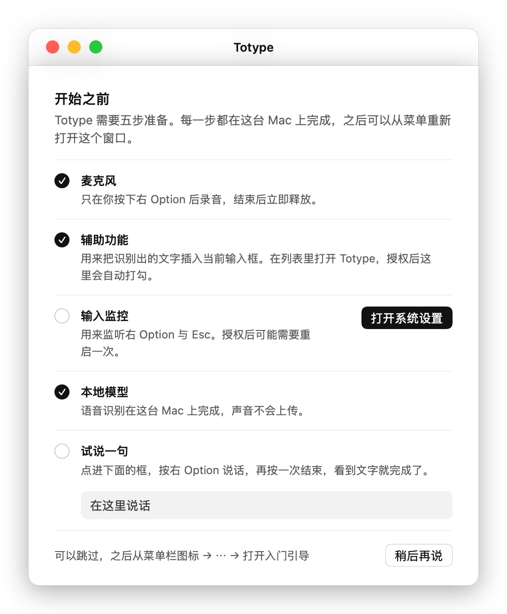

# 02 首次运行与授权

[English](../en/02-first-run.md)

Totype 需要三项系统权限：麦克风用来录音，辅助功能用来把文字插入当前输入框，输入监控用来监听右 Option 和 Esc。三项都给了以后，按一下右 Option 就能开始。输入监控授权后，应用通常需要退出再打开一次才生效。

## 首次运行引导

第一次启动时，Totype 会打开一个标题为“开始之前”的窗口，共五步：麦克风、辅助功能、输入监控、本地模型、试说一句。做完的步骤会打勾，下一个需要你操作的步骤，按钮是实心的。输入监控授权后可能出现“立即重启”，因为热键要重启后才生效。本地模型一步有“下载”按钮；如果你已经保存了云端 Key，这一步会提示本地模型可以之后再装。最后一步点进输入框，按右 Option 说话，再按一次结束。全部完成后右下角按钮是“完成”，否则是“稍后再说”，点它就关闭窗口。

如果三项权限都已授予，并且有本地模型或云端 Key，窗口不会自动打开。任何时候都可以重新打开：菜单栏图标 → “⋯” → “打开入门引导…”。跳过引导的话，按下面的手动步骤做同样的事。

## 手动授权

应用只在菜单栏里显示，没有 Dock 图标。启动后，屏幕顶部菜单栏会出现它的图标。

1. **麦克风。** 第一次开始录音时系统会弹出授权提示，点“允许”。如果当时点了“不允许”，到 系统设置 → 隐私与安全性 → 麦克风，打开 Totype 的开关。
2. **辅助功能。** 点菜单栏图标打开菜单面板，点右下角的“⋯”，选“检查辅助功能”，系统会引导你到 系统设置 → 隐私与安全性 → 辅助功能。打开 Totype 的开关；列表里没有它时，点“+”添加 `/Applications/Totype.app`。菜单面板里“插入”一栏显示“辅助功能 · 可用”即表示通过。
3. **输入监控。** 同样从“⋯”里选“检查输入监控”，到 系统设置 → 隐私与安全性 → 输入监控 打开开关。授权后退出应用再重新打开。
4. **试说一句。** 点开任意文本框，按一下右 Option，说一句话，再按一下右 Option。文字出现在光标处，浮窗显示“已插入 N 字”，就说明整条链路都通了。

## 授权失效的处理

输入监控没有生效时，按右 Option 没有反应，或者录音时浮窗显示“Esc 不可用”，菜单面板顶部会提示“Esc 取消不可用：需要重新授权输入监控”，并给出“打开设置”按钮。在输入监控列表里删掉 Totype，再重新添加，然后重启应用。

用未公证的构建时，每次更新后都可能遇到这种情况，因为系统把授权绑在构建的代码签名上。三个列表都检查一遍：删旧条目、重新授权、重启应用。从源码构建的用户用稳定的本机签名身份，可以避免反复授权，见 [01 安装](01-install.md)。
