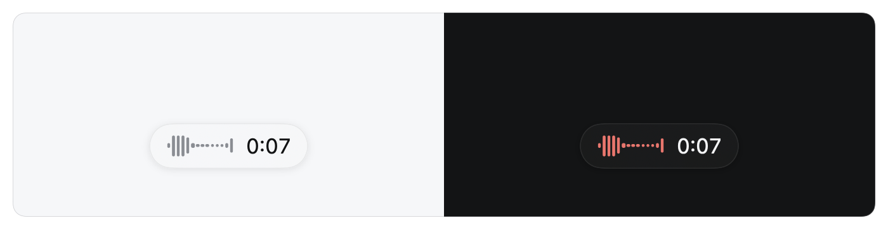
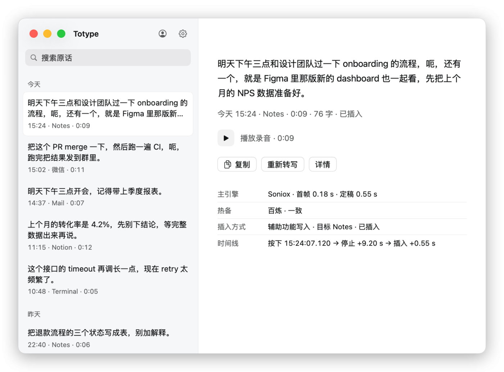

# 03 日常使用

[English](../en/03-daily-use.md)

右 Option 单击开始录音，再单击一次结束并插入文字，Esc 取消。屏幕底部的浮窗显示当前状态。文字只会插入你开始录音时所在的应用；终端里只输入文字，不会替你按回车。

## 基本流程

1. 让光标停在要输入的位置。
2. 按一下**右 Option**。浮窗出现，显示波形和计时：“正在听”。
3. 说话。
4. 再按一下右 Option。浮窗变为“识别中”，识别完成后文字被插入，浮窗显示“已插入 N 字”。如果这次是由其他引擎完成的，浮窗会在后面注明，例如“Soniox 余额不足，已改用阿里云”。

也可以不用热键：点菜单栏图标，菜单面板里的“开始录音”和“结束并插入”按钮作用相同。

单次录音默认最长 180 秒，到时会自动定稿。可以在设置的“高级与诊断”里调整。

## 取消与撤销

录音中按 **Esc**，或点菜单面板里的“取消”，这次录音被取消，不插入任何文字。浮窗显示“已取消 · N 秒内可撤销”，5 秒内点“撤销”（或菜单面板里的“撤销取消”）可以恢复并继续转写；这时再按右 Option 会直接开始一次新的录音。取消后音频仍保留在历史里，之后可以重新转写。

Esc 依赖输入监控权限。权限缺失时，浮窗和菜单面板会明确显示“Esc 不可用”。

## 浮窗状态

| 浮窗文字 | 含义 |
|---|---|
| 正在听 + 波形、计时 | 正在录音。波形上的红色只在录音时出现 |
| 识别中 | 已停止录音，正在转写和插入 |
| 已插入 N 字 | 文字已发送到输入框。后面可能带一句说明，如改用了哪个引擎 |
| 已取消 · N 秒内可撤销 | 录音被取消，可在倒计时内撤销 |
| 失败信息（带“!”） | 这次没有插入，信息里说明原因；录音已留在历史里 |
| 预览卡片 | 无法确认插入位置，文字显示在卡片里，按钮为“插入当前输入框”“复制”“关闭” |

## 预览卡片

在以下情况 Totype 不会强行插入，而是弹出预览卡片，把文字交给你决定：

- 结束录音时你已经切换到其他应用（提示“你已切换到其他应用，未自动输入；可点‘复制’”）。
- 结束后检测到你在键盘上输入，为避免打断你正在打的字而没有自动插入。
- 目标应用的状态无法确认。

在卡片里点“插入当前输入框”把文字放到当前焦点，点“复制”放进剪贴板，点“关闭”放弃。自动插入从不碰剪贴板；只有你点“复制”时，剪贴板才会改变。

## 不会开始录音的情况

- **中文输入法正在组词。** 如果检测到拼音等输入法的候选文字还没有上屏，会提示“检测到尚未上屏的中文输入法组合文本；先上屏或取消拼音，再按一下右 Option”。
- **安全输入字段。** 在密码框等安全输入字段里会暂停语音输入。系统的 Secure Input 被其他应用占用时，热键可能收不到事件，提示为“系统 Secure Input 正在占用键盘事件；先退出密码框或关闭占用它的应用”。
- **所选引擎没有配置。** 例如选了 Soniox 但没有保存 Key，会提示“已选择 Soniox，但未配置 API Key；不会切换到系统听写”。

## 菜单面板

点菜单栏图标，面板里显示当前状态和一句提示、开始或结束按钮，以及三项信息：“主引擎”（后面带“未配置”时表示该引擎还不能用）、“插入”（辅助功能是否可用）、“麦克风”（录音中，或“按需释放”：不录音时麦克风完全释放，不影响 iPhone 接力等功能）。底部的“打开历史…”进入历史窗口，“⋯”里有“检查辅助功能”“检查输入监控”“打开数据目录”和退出项。

## 历史窗口

历史窗口左侧按日期分组列出最近 20 条记录，顶部有“搜索原话”。单击一条会复制它的全文，并在右侧显示详情：完整文字、时间、目标应用、时长、字数和结果（已插入、仅预览、已取消、失败等）。

详情页有这些操作：

- **播放录音。** 播放保留下来的原始音频。
- **复制。** 复制全文。
- **重新转写。** 用保留的音频再转写一次，在“详情”里可以选“自动”“Soniox”“阿里云”或“本地”。结果作为新版本追加保存，不会自动插入，也不覆盖原来的文字。
- **详情。** 展开各版本，以及主引擎的首帧和定稿耗时、热备引擎的结果是否一致、插入方式和时间线。

没有文字、只保留了音频的记录，列表里显示“已保留音频，尚无文字”，可以用“重新转写”补上。左上角点应用名回到录音状态，右上角的人像图标进入“个人资料”，齿轮图标进入“设置”。

